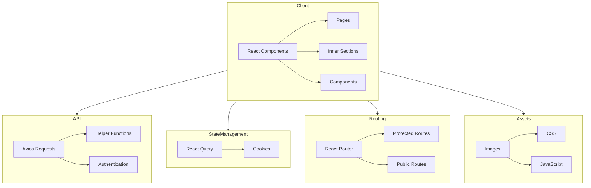

    

    <b>Automatic Architecture Diagrams from Code</b> 
    <a href="https://github.com/swark-io/swark">GitHub</a> • <a href="https://swark.io">Website</a> • <a href="mailto:contact@swark.io">Contact Us</a>

## Usage Instructions

1. **Render the Diagram**: Use the links below to open it in Mermaid Live Editor, or install the [Mermaid Support](https://marketplace.visualstudio.com/items?itemName=bierner.markdown-mermaid) extension.
2. **Recommended Model**: If available for you, use `claude-3.5-sonnet` [language model](vscode://settings/swark.languageModel). It can process more files and generates better diagrams.
3. **Iterate for Best Results**: Language models are non-deterministic. Generate the diagram multiple times and choose the best result.

## Generated Content
**Model**: GPT-4o - [Change Model](vscode://settings/swark.languageModel)  
**Mermaid Live Editor**: [View](https://mermaid.live/view#pako:eNp1UstugzAQ_BXL5-QHOFQi5EWeNPRmenBgQ6yCTf2oGkX59zpgIqOkN8_senZ27CvORQE4wBkvJW3O6GOacYSUOXYwqhhwfacQCskBaK5RJOpGcEurz64wIQktoUcRiTkHiVLINRO8p6fk6V6IxuM3NPFB5IPWCvAi4wNPYRJ3XTMS_jKh0AG-DaiH7JwsoWqsg7nhAwsLEhp9tgZYTu-8o2ftsLkPFq8np5pq2FJut60fsSxdLO8G5MVJxnZZ8cUemSxb1fi16kEYzXjZda6c2p0E6a6vSSKFtnlC0RV63Q1JzLFi-ZBdtdPWPtj8E6VSoFXXuCVx7T3jjkRp6s57sqI_NM0la7Sjtq3szgf7wYzu57QF92Ae8yJIr-oF4qs4r3iEa5A1ZYX9ttcM2xetIcMBynABJ2oqneGbbTJNYYdMGbWr1jjQ0sAIU6NFeuF5j6Uw5RkHJ1opuP0B9gD2Cg) | [Edit](https://mermaid.live/edit#pako:eNp1UstugzAQ_BXL5-QHOFQi5EWeNPRmenBgQ6yCTf2oGkX59zpgIqOkN8_senZ27CvORQE4wBkvJW3O6GOacYSUOXYwqhhwfacQCskBaK5RJOpGcEurz64wIQktoUcRiTkHiVLINRO8p6fk6V6IxuM3NPFB5IPWCvAi4wNPYRJ3XTMS_jKh0AG-DaiH7JwsoWqsg7nhAwsLEhp9tgZYTu-8o2ftsLkPFq8np5pq2FJut60fsSxdLO8G5MVJxnZZ8cUemSxb1fi16kEYzXjZda6c2p0E6a6vSSKFtnlC0RV63Q1JzLFi-ZBdtdPWPtj8E6VSoFXXuCVx7T3jjkRp6s57sqI_NM0la7Sjtq3szgf7wYzu57QF92Ae8yJIr-oF4qs4r3iEa5A1ZYX9ttcM2xetIcMBynABJ2oqneGbbTJNYYdMGbWr1jjQ0sAIU6NFeuF5j6Uw5RkHJ1opuP0B9gD2Cg)

