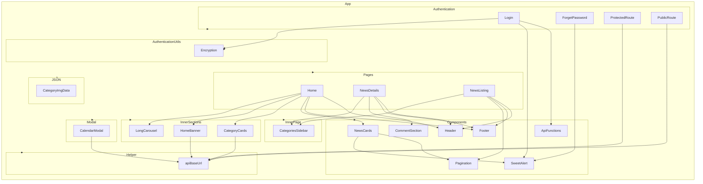

    

    <b>Automatic Architecture Diagrams from Code</b> 
    <a href="https://github.com/swark-io/swark">GitHub</a> • <a href="https://swark.io">Website</a> • <a href="mailto:contact@swark.io">Contact Us</a>

## Usage Instructions

1. **Render the Diagram**: Use the links below to open it in Mermaid Live Editor, or install the [Mermaid Support](https://marketplace.visualstudio.com/items?itemName=bierner.markdown-mermaid) extension.
2. **Recommended Model**: If available for you, use `claude-3.5-sonnet` [language model](vscode://settings/swark.languageModel). It can process more files and generates better diagrams.
3. **Iterate for Best Results**: Language models are non-deterministic. Generate the diagram multiple times and choose the best result.

## Generated Content
**Model**: GPT-4o - [Change Model](vscode://settings/swark.languageModel)  
**Mermaid Live Editor**: [View](https://mermaid.live/view#pako:eNqVVctu2zAQ_BWD5-QHfCjgxA2SIk2NqjlVPazFjUxAIgU-YBhB_r2U9SC5YmxEJ2lmuRwuZ1fvrFIc2ZqVstbQHVZ_tqVc-ce4_QBsum5AEnQHNZqA98-jajFFXvBotmhBNGZJPAtjhawDgZJnNto4e0BpRQVWKJmmeVa1INCD0jXaHRhzVJqn3E4ri5VF_ls5S6Tu3L4RFSHyiu5V2ynpNdHzI3DUVI7fkmC-dEJmTtMX5R40J2n9dq3frPDKF0uKI6LdNKhtim868eDkeYG5dpwnKVGP2TM3egc9T-sua69UOYMNEQsWa6VP5BwXdu6NlM0h0BSC4x70tTw_FYeFjsbHgiZUfv2P4tdL_hhPbb0FC9cSPGLT0RoN2HQLf6ETd2DwVTf_vub4V7vonu-y0qcudcOc6vwyvPrOXd3efot7dYJyXTVx1N8TnjFKQoWbnOCo-hMUaj0hcfHy8sYSDCG9J8d1od1mMO63GSSNNeMZs4bsxPozkXp_IKM5t5BGuVgh5XKtvohZdkcIHGdqVkTMURExR8cT5T8VcJ7Gw_Utxk_g6MgKTGzrgUuH-WL5EJRO9chSk4QxLAz4bEw47NkOn5YisEspiaEu7BLMdSEoGWHZOHbDWtQtCO7_3-8l8z3j_8BsvSoZxzdwjS3Zhw9yHffCtgL8fGnZ2mqHNwycVcVJVtO3d3R9YOs3aAx-_AevaXML) | [Edit](https://mermaid.live/edit#pako:eNqVVctu2zAQ_BWD5-QHfCjgxA2SIk2NqjlVPazFjUxAIgU-YBhB_r2U9SC5YmxEJ2lmuRwuZ1fvrFIc2ZqVstbQHVZ_tqVc-ce4_QBsum5AEnQHNZqA98-jajFFXvBotmhBNGZJPAtjhawDgZJnNto4e0BpRQVWKJmmeVa1INCD0jXaHRhzVJqn3E4ri5VF_ls5S6Tu3L4RFSHyiu5V2ynpNdHzI3DUVI7fkmC-dEJmTtMX5R40J2n9dq3frPDKF0uKI6LdNKhtim868eDkeYG5dpwnKVGP2TM3egc9T-sua69UOYMNEQsWa6VP5BwXdu6NlM0h0BSC4x70tTw_FYeFjsbHgiZUfv2P4tdL_hhPbb0FC9cSPGLT0RoN2HQLf6ETd2DwVTf_vub4V7vonu-y0qcudcOc6vwyvPrOXd3efot7dYJyXTVx1N8TnjFKQoWbnOCo-hMUaj0hcfHy8sYSDCG9J8d1od1mMO63GSSNNeMZs4bsxPozkXp_IKM5t5BGuVgh5XKtvohZdkcIHGdqVkTMURExR8cT5T8VcJ7Gw_Utxk_g6MgKTGzrgUuH-WL5EJRO9chSk4QxLAz4bEw47NkOn5YisEspiaEu7BLMdSEoGWHZOHbDWtQtCO7_3-8l8z3j_8BsvSoZxzdwjS3Zhw9yHffCtgL8fGnZ2mqHNwycVcVJVtO3d3R9YOs3aAx-_AevaXML)

